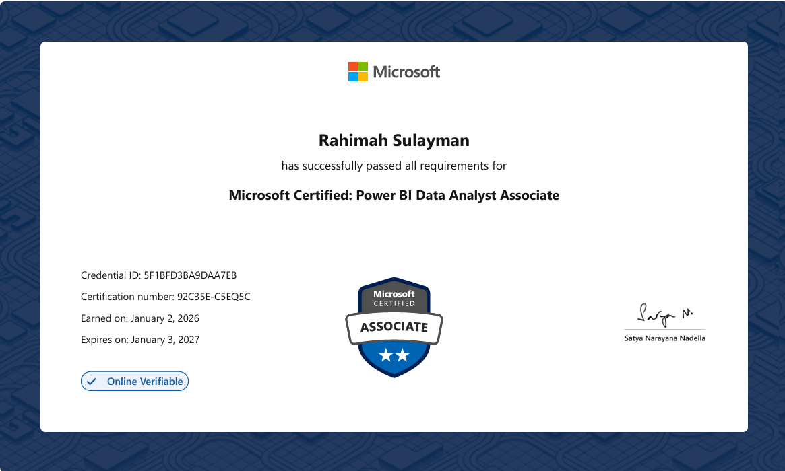
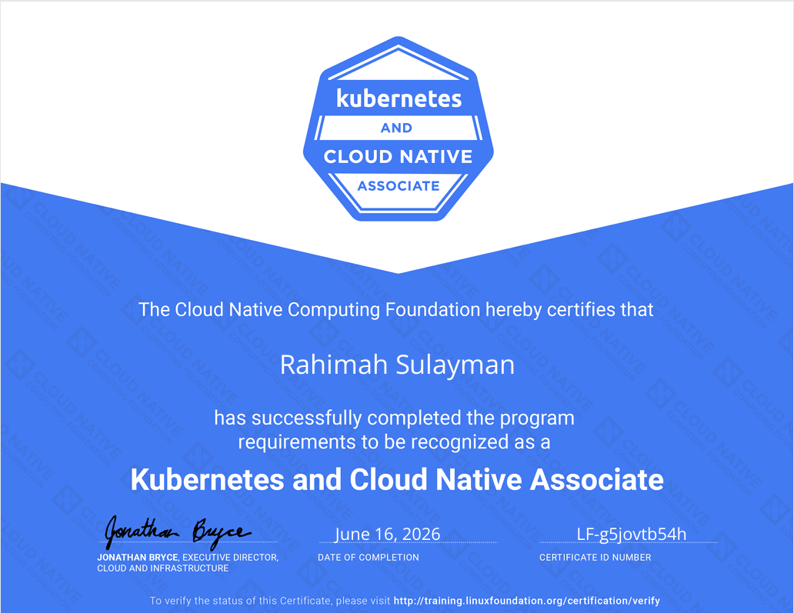
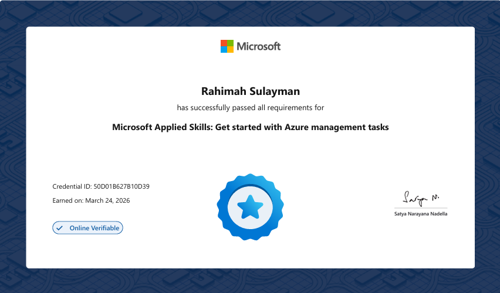
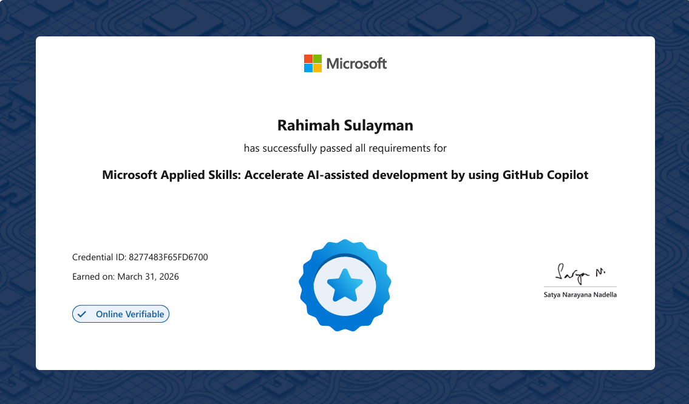
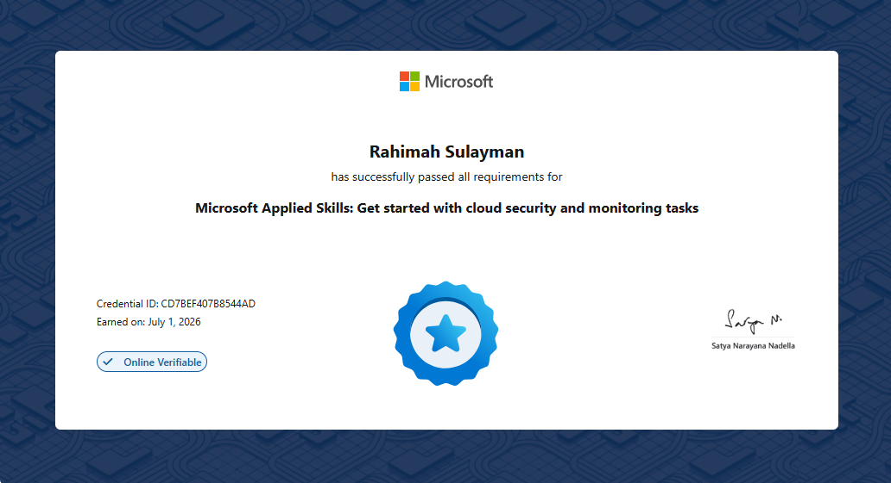
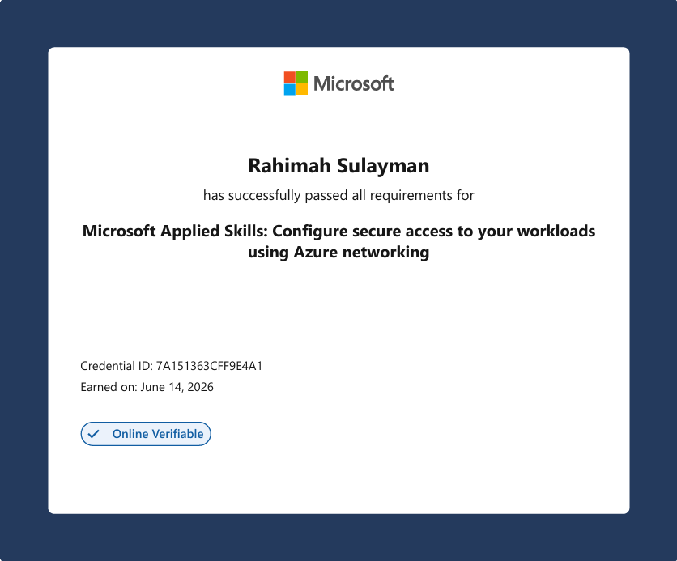
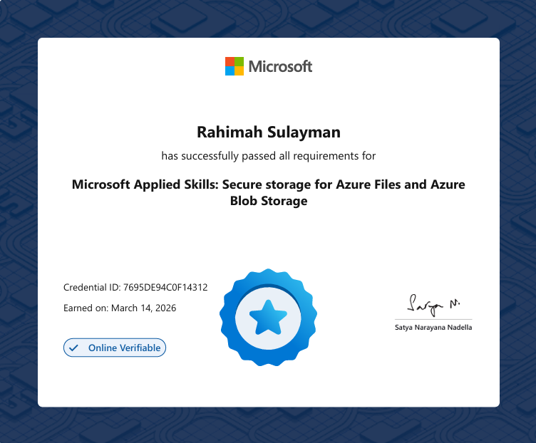

<h1 align="center">Hi 👋, I'm Rahimah Sulayman</h1>

<h3 align="center">
☁️ AZ-104 Certified | ☸️ KCNA Certified | 🐧 Linux Enthusiast | 📊 PL-300 Certified | 🚀 Cloud & DevOps Engineer 

</h3>

  

## 🏆 Open Source Contributor

• Successfully contributed to and merged changes into a public GitHub project.

## 👩‍💻 About Me

- ☁️ Microsoft Certified **Azure Administrator Associate (AZ-104)**
- 📊 Microsoft Certified: **Power BI Data Analyst Associate**
- ☸️ Certified **Kubernetes and Cloud Native Associate (KCNA)**
- 🐧 Passionate about Linux, Cloud Computing and Open-Source Technologies
- 🚀 Currently building hands-on projects in **Linux, Git, GitHub and Microsoft Azure**
- 🌱 Continuously learning **Docker, Kubernetes, Bash Scripting and DevOps**
- 🎯 Goal: To become a highly skilled **Cloud & DevOps Engineer**
- ⚡ I believe in learning by building real-world projects.

## 🛠️ Microsoft Applied Skills

- ✅ **Get Started with Azure Management Tasks**
- ✅ **Accelerate AI-Assisted Development by Using GitHub Copilot**
- ✅ **Get Started with Cloud Security and Monitoring Tasks**
- ✅ **Configure Secure Access to Your Workloads Using Azure Networking**
- ✅ **Secure Storage for Azure Files and Azure Blob Storage**
- ✅ **Get started with Identities and access using Microsoft Entra**
  
## 🏆 Certifications & Microsoft Applied Skills

  
  
  

  
  
  
  
  
  

## Badges

  

## 🤝 Open Source Contributions

### 📌 PinpointPro

Contributed to **PinpointPro**, an open-source location intelligence project, by improving project documentation and maintaining contributor records.

### 🚀 Contributions

#### ✅ PR #7 – Browser Prerequisites Documentation
- Clarified browser prerequisites in the project's `README.md` by adding examples of modern browsers that support ES6 modules.
- Improved the onboarding experience for new users by making setup requirements clearer.

🔗 **Pull Request:** https://github.com/raphgm/pinpointpro/pull/7

---

#### ✅ PR #3 – CONTRIBUTORS.md Update
- Added my details to the project's `CONTRIBUTORS.md` as a **Phase 2 Project Contributor**.
- Helped keep contributor records accurate and acknowledge community participation.

🔗 **Pull Request:** https://github.com/raphgm/pinpointpro/pull/3

---

### 🏆 Impact

- Successfully submitted **2 merged pull requests**.
- Both contributions were **reviewed, approved, and merged** by the project maintainer.
- Demonstrated proficiency with GitHub's open-source collaboration workflow, including forks, feature branches, pull requests, code reviews, and merges.

🔗 **Repository:** https://github.com/raphgm/pinpointpro

⭐ Looking forward to contributing to more open-source projects in Cloud, DevOps, Linux, and Kubernetes.

## 🤝 Connect with Me

  

  

  

## 🛠️ Languages & Tools

  

## 🚀 Featured Projects

- 🐧 **[Linux Commands Repository](https://github.com/rahimahisah17/linux-commands)** – A comprehensive collection of Linux commands with explanations, real-world use cases, examples, and screenshots.
- ☁️ **Azure Projects** *(Coming Soon)*
- ☸️ **Cloud & DevOps Projects** *(Coming Soon)*

- 
  

